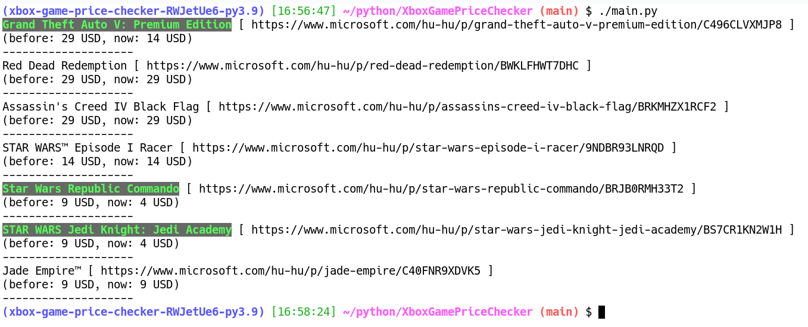

Xbox Game Price Checker
=======================

A simple command-line program that checks the price
of a list of Xbox games. It's useful if you want to
buy some games on sale.

Screenshot
----------

Usage
-----

Visit https://www.xbox.com/en-US/games/all-games to browse all
the available Xbox games. As of August 2021, 2637 games are
listed here.

Tip #1: Go down to the bottom of the page and select how many items
you want to see per page. The default is 50 but you can also select 200.

Tip #2: You can change the language of the MS Store. For instance,
to browse the Store in German, use the URL https://www.xbox.com/de-DE/games/all-games .

If you want to register a game in this program, then simply
copy the URL of the game and paste it in the file `gamelist.txt`.
The URL of a game typically looks like this:

    https://www.microsoft.com/en-us/p/the-witcher-3-wild-hunt--game-of-the-year-edition/C261457LCNMJ

where "C261457LCNMJ" at the end is the ID of the game.

The file `gamelist.txt` has no specific format. The program will extract
all URLs from it. If a line starts with `#`, then it'll be discarded.

When you are ready with the file `gamelist.txt`, start the program:

    ./main.py

It'll check the price of all your registered games. If a game is on sale,
then its title will be marked as green.

Settings
--------

Edit `settings.py` and change the values of `MARKET` and `LOCALE`. For instance,
if you live in the US, use these values:

    MARKET = "US"
    LOCALE = "en-US"

Links
-----

* https://www.xbox.com/en-US/games/all-games (list of all Xbox games on MS Store)
* https://github.com/ThomasPe/MS-Store-API (MS Store API examples)
